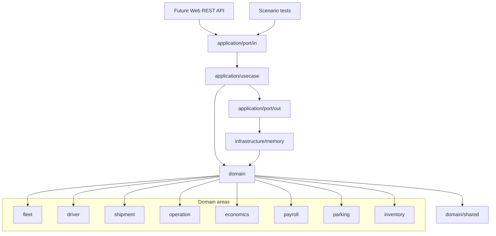

# Diagramma architettura

```mermaid
flowchart TD
    WEB[Future Web REST API] --> IN[application/port/in]
    TEST[Scenario tests] --> IN
    IN --> USECASE[application/usecase]
    USECASE --> DOMAIN[domain]
    USECASE --> OUT[application/port/out]
    OUT --> MEMORY[infrastructure/memory]
    MEMORY --> DOMAIN
    DOMAIN --> SHARED[domain/shared]

    subgraph Domain areas
        FLEET[fleet]
        DRIVER[driver]
        SHIPMENT[shipment]
        OPERATION[operation]
        ECON[economics]
        PAYROLL[payroll]
        PARKING[parking]
        INVENTORY[inventory]
    end

    DOMAIN --> FLEET
    DOMAIN --> DRIVER
    DOMAIN --> SHIPMENT
    DOMAIN --> OPERATION
    DOMAIN --> ECON
    DOMAIN --> PAYROLL
    DOMAIN --> PARKING
    DOMAIN --> INVENTORY
```
