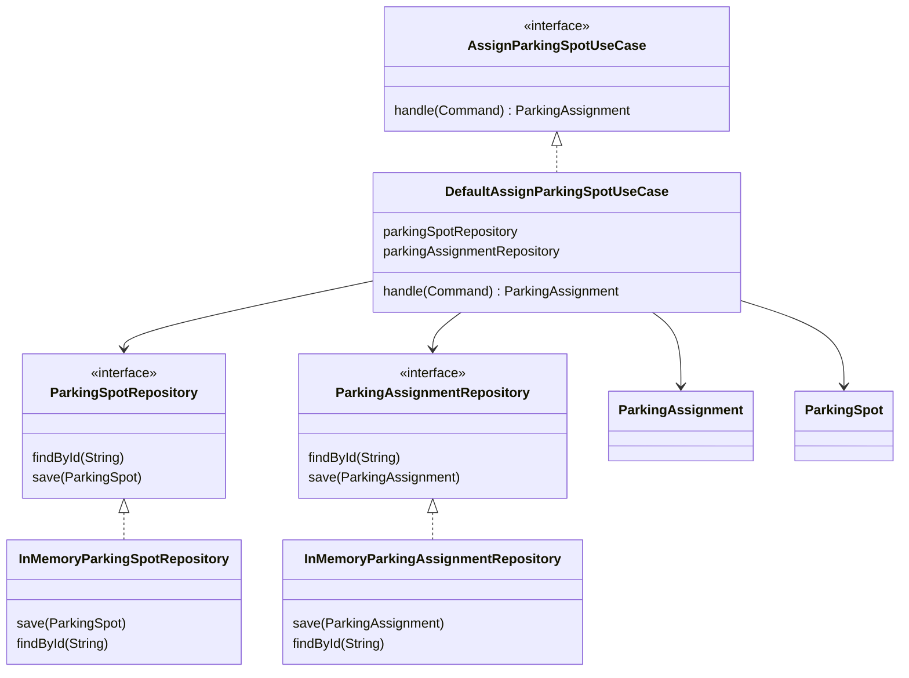

# Class diagram — Application layer

```mermaid
classDiagram
    class AssignParkingSpotUseCase {
      <<interface>>
      handle(Command) ParkingAssignment
    }
    class DefaultAssignParkingSpotUseCase {
      parkingSpotRepository
      parkingAssignmentRepository
      handle(Command) ParkingAssignment
    }
    class ParkingSpotRepository {
      <<interface>>
      findById(String)
      save(ParkingSpot)
    }
    class ParkingAssignmentRepository {
      <<interface>>
      findById(String)
      save(ParkingAssignment)
    }
    class InMemoryParkingSpotRepository {
      save(ParkingSpot)
      findById(String)
    }
    class InMemoryParkingAssignmentRepository {
      save(ParkingAssignment)
      findById(String)
    }
    class ParkingAssignment
    class ParkingSpot

    AssignParkingSpotUseCase <|.. DefaultAssignParkingSpotUseCase
    DefaultAssignParkingSpotUseCase --> ParkingSpotRepository
    DefaultAssignParkingSpotUseCase --> ParkingAssignmentRepository
    ParkingSpotRepository <|.. InMemoryParkingSpotRepository
    ParkingAssignmentRepository <|.. InMemoryParkingAssignmentRepository
    DefaultAssignParkingSpotUseCase --> ParkingAssignment
    DefaultAssignParkingSpotUseCase --> ParkingSpot
```
