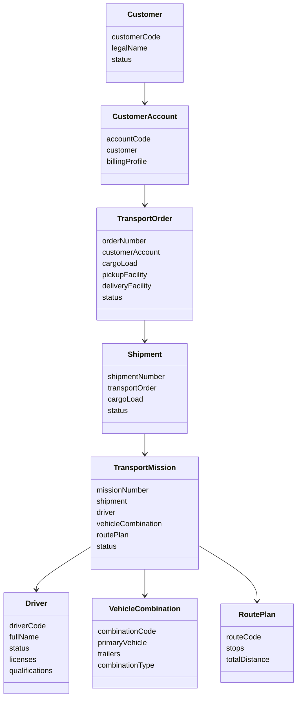

# Class diagram — Core transport flow

```mermaid
classDiagram
    class Customer {
      customerCode
      legalName
      status
    }
    class CustomerAccount {
      accountCode
      customer
      billingProfile
    }
    class TransportOrder {
      orderNumber
      customerAccount
      cargoLoad
      pickupFacility
      deliveryFacility
      status
    }
    class Shipment {
      shipmentNumber
      transportOrder
      cargoLoad
      status
    }
    class TransportMission {
      missionNumber
      shipment
      driver
      vehicleCombination
      routePlan
      status
    }
    class Driver {
      driverCode
      fullName
      status
      licenses
      qualifications
    }
    class VehicleCombination {
      combinationCode
      primaryVehicle
      trailers
      combinationType
    }
    class RoutePlan {
      routeCode
      stops
      totalDistance
    }

    Customer --> CustomerAccount
    CustomerAccount --> TransportOrder
    TransportOrder --> Shipment
    Shipment --> TransportMission
    TransportMission --> Driver
    TransportMission --> VehicleCombination
    TransportMission --> RoutePlan
```
