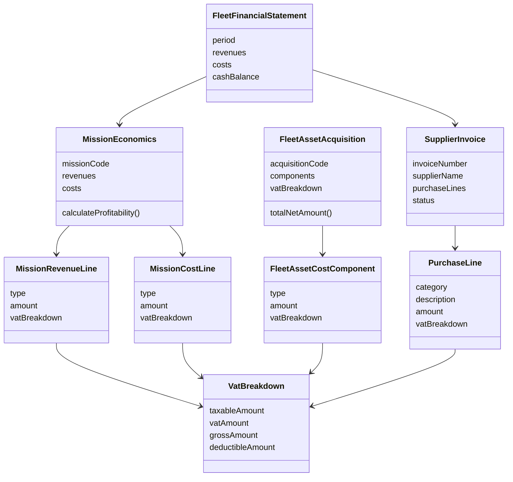

# Class diagram — Economics

```mermaid
classDiagram
    class MissionEconomics {
      missionCode
      revenues
      costs
      calculateProfitability()
    }
    class MissionRevenueLine {
      type
      amount
      vatBreakdown
    }
    class MissionCostLine {
      type
      amount
      vatBreakdown
    }
    class FleetAssetAcquisition {
      acquisitionCode
      components
      vatBreakdown
      totalNetAmount()
    }
    class FleetAssetCostComponent {
      type
      amount
      vatBreakdown
    }
    class SupplierInvoice {
      invoiceNumber
      supplierName
      purchaseLines
      status
    }
    class PurchaseLine {
      category
      description
      amount
      vatBreakdown
    }
    class FleetFinancialStatement {
      period
      revenues
      costs
      cashBalance
    }
    class VatBreakdown {
      taxableAmount
      vatAmount
      grossAmount
      deductibleAmount
    }

    MissionEconomics --> MissionRevenueLine
    MissionEconomics --> MissionCostLine
    MissionRevenueLine --> VatBreakdown
    MissionCostLine --> VatBreakdown
    FleetAssetAcquisition --> FleetAssetCostComponent
    FleetAssetCostComponent --> VatBreakdown
    SupplierInvoice --> PurchaseLine
    PurchaseLine --> VatBreakdown
    FleetFinancialStatement --> MissionEconomics
    FleetFinancialStatement --> SupplierInvoice
```
