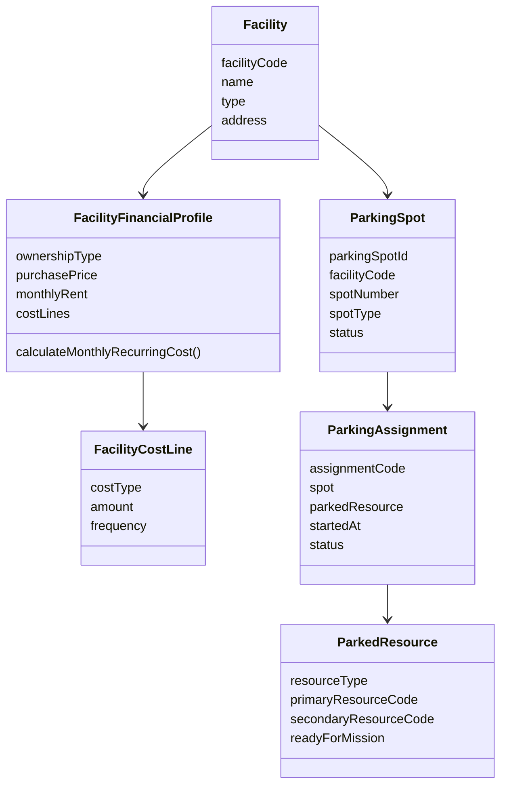

# Class diagram — Facility e parking

```mermaid
classDiagram
    class Facility {
      facilityCode
      name
      type
      address
    }
    class FacilityFinancialProfile {
      ownershipType
      purchasePrice
      monthlyRent
      costLines
      calculateMonthlyRecurringCost()
    }
    class FacilityCostLine {
      costType
      amount
      frequency
    }
    class ParkingSpot {
      parkingSpotId
      facilityCode
      spotNumber
      spotType
      status
    }
    class ParkedResource {
      resourceType
      primaryResourceCode
      secondaryResourceCode
      readyForMission
    }
    class ParkingAssignment {
      assignmentCode
      spot
      parkedResource
      startedAt
      status
    }

    Facility --> FacilityFinancialProfile
    FacilityFinancialProfile --> FacilityCostLine
    Facility --> ParkingSpot
    ParkingSpot --> ParkingAssignment
    ParkingAssignment --> ParkedResource
```
