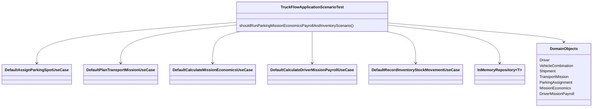

# Class diagram — Test di scenario

```mermaid
classDiagram
    class TruckFlowApplicationScenarioTest {
      shouldRunParkingMissionEconomicsPayrollAndInventoryScenario()
    }
    class DefaultAssignParkingSpotUseCase
    class DefaultPlanTransportMissionUseCase
    class DefaultCalculateMissionEconomicsUseCase
    class DefaultCalculateDriverMissionPayrollUseCase
    class DefaultRecordInventoryStockMovementUseCase
    class InMemoryRepository~T~
    class DomainObjects {
      Driver
      VehicleCombination
      Shipment
      TransportMission
      ParkingAssignment
      MissionEconomics
      DriverMissionPayroll
    }

    TruckFlowApplicationScenarioTest --> DefaultAssignParkingSpotUseCase
    TruckFlowApplicationScenarioTest --> DefaultPlanTransportMissionUseCase
    TruckFlowApplicationScenarioTest --> DefaultCalculateMissionEconomicsUseCase
    TruckFlowApplicationScenarioTest --> DefaultCalculateDriverMissionPayrollUseCase
    TruckFlowApplicationScenarioTest --> DefaultRecordInventoryStockMovementUseCase
    TruckFlowApplicationScenarioTest --> InMemoryRepository
    TruckFlowApplicationScenarioTest --> DomainObjects
```
