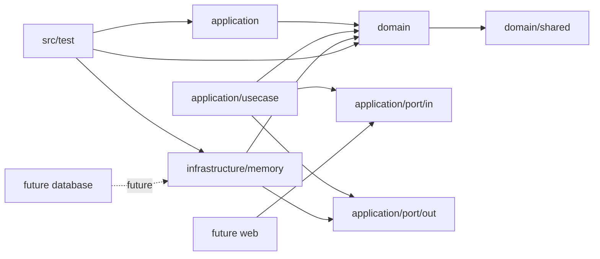

# Package dependency map

```mermaid
flowchart LR
    domain[domain]
    shared[domain/shared]
    application[application]
    portin[application/port/in]
    portout[application/port/out]
    usecase[application/usecase]
    memory[infrastructure/memory]
    tests[src/test]
    futureweb[future web]
    futuredatabase[future database]

    domain --> shared
    application --> domain
    usecase --> portin
    usecase --> portout
    usecase --> domain
    memory --> portout
    memory --> domain
    tests --> application
    tests --> memory
    tests --> domain
    futureweb --> portin
    futuredatabase -. future .-> memory
```
